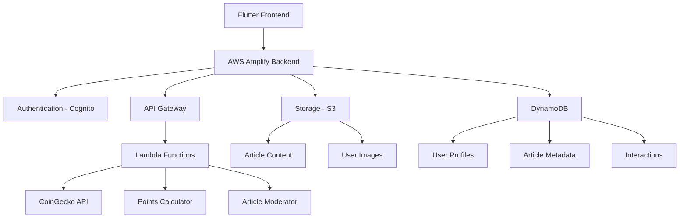
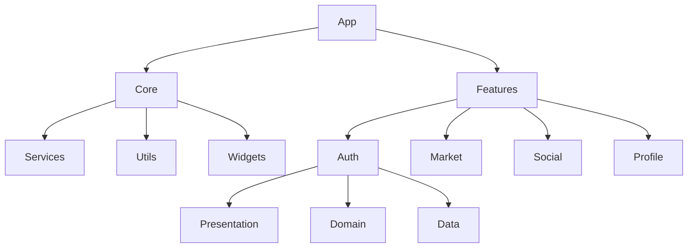
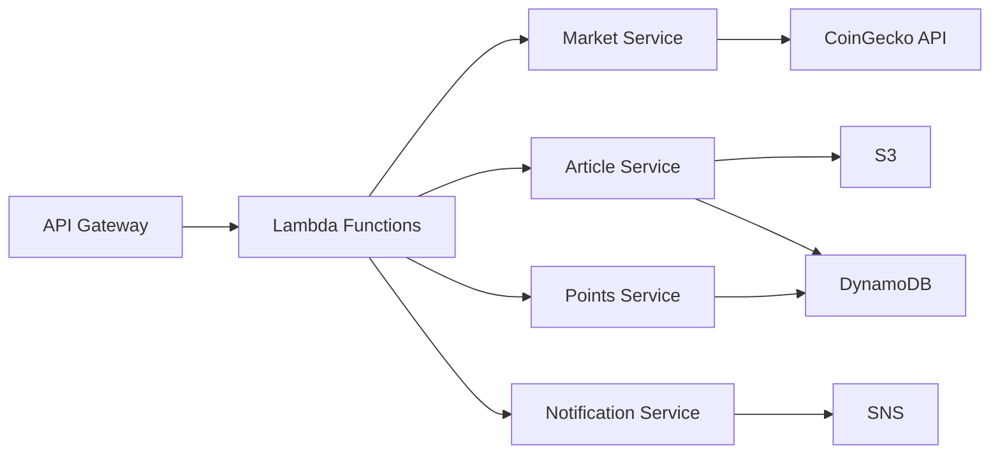

# Kointos Implementation Plan

## System Architecture



## 1. Core Features Implementation

### 1.1 Authentication System
- Integration with AWS Cognito
- Features:
  - Email/Password signup
  - Email verification
  - Password reset flow
  - Social login (future enhancement)
- Security:
  - JWT token management
  - Secure session handling
  - Rate limiting

### 1.2 Market Data Integration
- CoinGecko API Integration:
  - Real-time price data
  - Historical price data for charts
  - Market metadata (volume, market cap, etc.)
- Features:
  - Silent refresh every 30 seconds
  - Websocket for critical price alerts
  - Mini charts using Flutter charts library
  - Advanced filtering and sorting options
- Portfolio Management:
  - Mock trading system
  - Portfolio value tracking
  - Price alerts and notifications
  - Performance analytics

### 1.3 Social Article System
- Content Storage:
  - Article metadata in DynamoDB
  - Markdown content in S3
  - Images in S3 with CDN integration
- Features:
  - Rich text editor with markdown support
  - Image upload with compression
  - Draft saving system
  - Tags and categories
- Social Interactions:
  - Like system
  - Nested comments
  - Follow system
  - Share functionality
- Content Moderation:
  - AWS Lambda-based moderation
  - Content filtering
  - Report system

### 1.4 Gamification System
- Dynamic Points System:
  - Base points for actions:
    * Article publishing: 10 points
    * Comments: 2 points
    * Likes given: 1 point
  - Multipliers based on engagement:
    * Articles: +0.5x points per 10 likes
    * Comments: +0.2x points per 5 likes
- Daily Rewards:
  - Reward wheel (daily spin)
  - Streak bonuses
  - Special event multipliers
- Achievement System:
  - Tiered achievements
  - Special badges
  - Progress tracking
- Future Crypto Conversion:
  - Points to token conversion system
  - Smart contract integration (future)

### 1.5 User Experience
- First-time Tutorial:
  - Interactive walkthrough
  - Feature discovery
  - Tooltips system
- Profile System:
  - Customizable profiles
  - Achievement showcase
  - Activity feed
- Notification System:
  - Price alerts
  - Social interactions
  - Achievement unlocks

## 2. Technical Architecture

### 2.1 Frontend Architecture (Flutter)


### 2.2 Backend Services (AWS)


## 3. Database Schema

### 3.1 DynamoDB Tables

#### UserProfile
```
- id: String (Primary Key)
- userId: String (GSI)
- username: String
- bio: String
- profileImage: String (S3 URL)
- points: Number
- achievements: List<String>
- following: List<String>
- followers: List<String>
- createdAt: Timestamp
- updatedAt: Timestamp
```

#### Article
```
- id: String (Primary Key)
- authorId: String (GSI)
- title: String
- summary: String
- contentKey: String (S3 key)
- images: List<String> (S3 URLs)
- tags: List<String>
- status: String (draft/published/moderation)
- likes: Number
- comments: Number
- points: Number
- createdAt: Timestamp
- updatedAt: Timestamp
```

#### Interaction
```
- id: String (Primary Key)
- type: String (like/comment/follow)
- userId: String (GSI)
- targetId: String (GSI)
- content: String (for comments)
- createdAt: Timestamp
```

## 4. Implementation Phases

### Phase 1: Foundation (Weeks 1-2)
- [ ] Complete AWS infrastructure setup
- [ ] Implement authentication system
- [ ] Set up basic navigation
- [ ] Create core data models

### Phase 2: Market Features (Weeks 3-4)
- [ ] Integrate CoinGecko API
- [ ] Implement market screen
- [ ] Add portfolio tracking
- [ ] Create price alerts

### Phase 3: Social Features (Weeks 5-6)
- [ ] Implement article system
- [ ] Add social interactions
- [ ] Create content moderation
- [ ] Set up image handling

### Phase 4: Gamification (Weeks 7-8)
- [ ] Implement points system
- [ ] Create achievement system
- [ ] Add reward wheel
- [ ] Set up notifications

### Phase 5: Polish & Launch (Weeks 9-10)
- [ ] Add tutorials
- [ ] Implement analytics
- [ ] Performance optimization
- [ ] User testing & feedback

## 5. Key Technical Considerations

### 5.1 Performance
- Implement caching for market data
- Lazy loading for images and content
- Pagination for lists and feeds
- Optimize database queries

### 5.2 Scalability
- Use AWS Auto Scaling
- Implement proper indexing
- Cache frequently accessed data
- Use CDN for static content

### 5.3 Security
- Input validation
- Rate limiting
- Content sanitization
- Secure file uploads

### 5.4 Monitoring
- Error tracking
- Performance monitoring
- User analytics
- System health checks